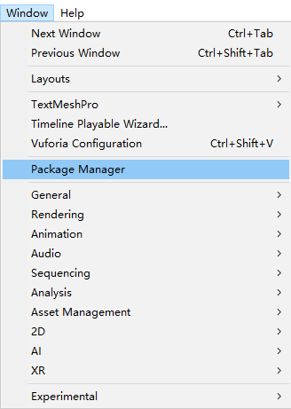
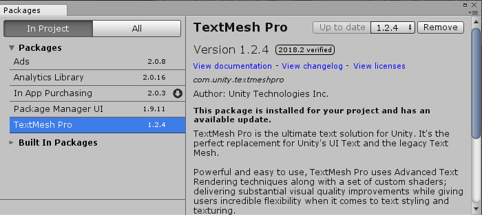

# MACS Unity Gamedev 101
Welcome to MACS Unity Gamedev 101!

This is a repository for a university computing society workshop event.

## Unity version
If you are doing the workshop with your own laptop, please use the version **2018.2.0f2** 
(to be consistent with the lab PCs).

## Are you using Git?
Good on ya! But make sure you **FORK** the repository first before cloning it. 

Although this is a public repository, pushing is not allowed unless I give you the write access :)

## Headstart
The Unity 2D game kit comes with an example level along with a UI menu. You may have an idea of how 
the game works.

It's located at `Assets/Scenes`. Have a go with `Start.unity`!

## Possible error that prevents you from running the game
You might see an error such as:
```
Multiple plugins with the same name 'vcomp120' (found at 'Packages/com.unity.textmeshpro/Plugins/vcomp120.dll' 
and 'Assets/2DGamekit/Utilities/TextMesh Pro/Plugins/vcomp120.dll'). That means one or more plugins are set to be 
compatible with Editor. Only one plugin at the time can be used by Editor.
```

The working project was updated from 2017.3.1f2, since then TextMesh Pro package/plugin wasn't integrated 
until version 2018. To avoid the conflict, unfortunately we will have to kick out the integrated 
TextMesh Pro utility. 



Here we remove the integrated TextMesh Pro package.



## Want to go further?
There are additional online resources to tackle around.  

[Unity Learn - 2D Game Kit](https://learn.unity.com/project/2d-game-kit)

[2D Game Kit Reference Guide](https://learn.unity.com/tutorial/2d-game-kit-reference-guide)

[2D Game Kit Advanced Topics](https://learn.unity.com/tutorial/2d-game-kit-advanced-topics#)